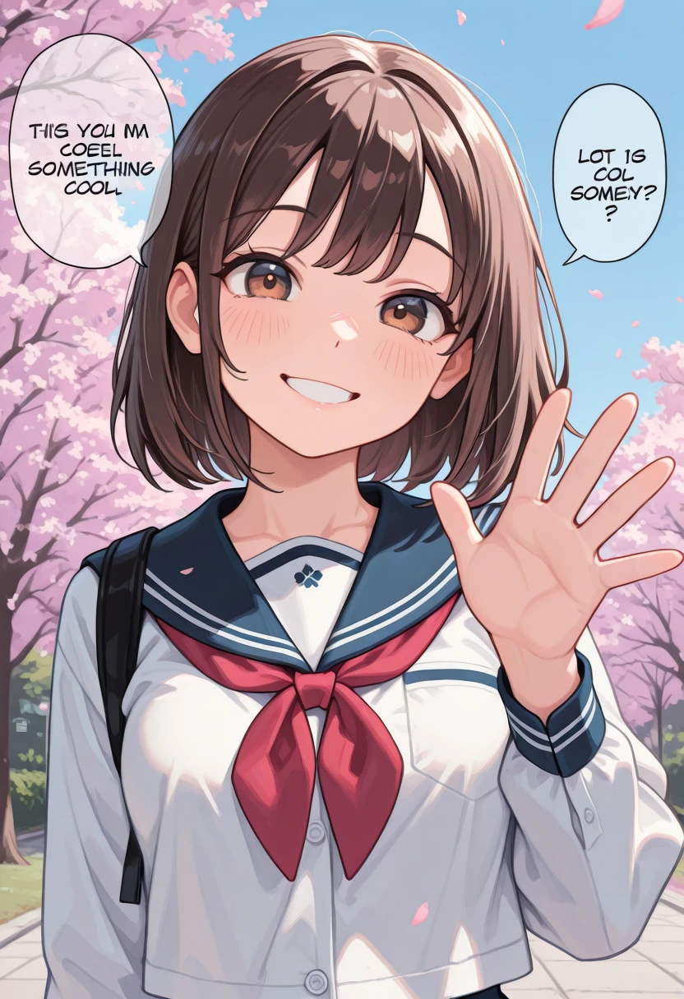
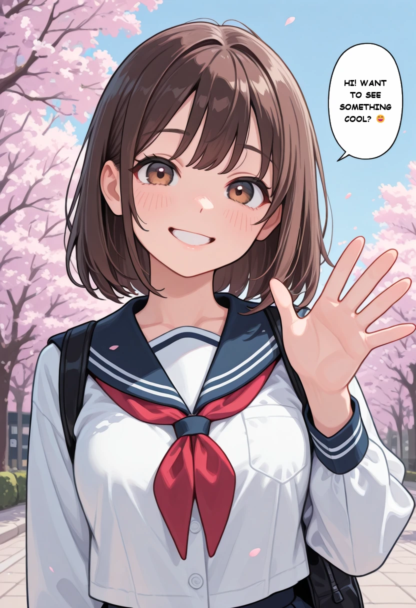

# ComfyUI-BubbleText 💬

**English** | [Español](README.es.md)

ComfyUI nodes that put **clean, readable text inside speech bubbles** generated by models like Anima, Illustrious or NoobAI.

Image models draw speech bubbles well, but with long sentences they misspell words ("REALUNIATY", repeated words…). These nodes let the model draw the bubble, then **erase the AI's text and write yours** with a real font, centered and at the largest size that fits.

## Before / after

Same seed and settings (Illustrious checkpoint `molKeunMix_deepcobaltV2`, 30 steps, CFG 5, `euler_ancestral`), text: `Hi! Want to see something cool? 😄`

| Without BubbleText (the model writes the text) | With BubbleText |
|:---:|:---:|
|  |  |

Prompt: `masterpiece, best quality, amazing quality, 1girl, solo, short brown hair, brown eyes, smile, waving, looking at viewer, school uniform, outdoors, blue sky, cherry blossoms, upper body`

## Nodes

### 💬 Bubble Text · Prompt (`SpeechBubblePrompt`)
Works like a LoRA for your prompt: place it between your prompt and `CLIP Text Encode`.

- With **ON** and some text, it appends the bubble request to the prompt:
  `speech bubble, english text, a single large white speech bubble with a thick black outline and black text at the top of the image, the speech bubble says "your text"`
- With **OFF** or empty text, the prompt passes through unchanged.
- Outputs the modified prompt plus a `bubble` config that goes into **Bubble Text · Write**.

### 💬 Bubble Text · Write (`SpeechBubbleRender`)
Place it between `VAE Decode` and your save node. It has no settings: it uses the config from **Bubble Text · Prompt**.

1. Finds the bubbles: white ones with an outline (thin outlines too), white ones without an outline if they have letters inside, and, as a fallback, black bubbles with letters inside. Bubbles joined together (e.g. two bubbles connected by the tail) are split apart.
2. Erases the letters the model made up.
3. Writes your text with the chosen font, wrapping lines and sizing it to fit.

If no bubble is found, the image is left untouched.

### 💬 Bubble Text (all-in-one) (`SpeechBubbleTextAuto`)
All-in-one version that only writes on the image, without touching the prompt.

## Options


| Option | What it does |
|---|---|
| `enabled` | ON/OFF. When off, neither the prompt nor the image is changed. |
| `text` | The bubble text. **A blank line** separates texts for several bubbles (in reading order). Emojis supported 😄 |
| `font` | Windows comic-style fonts (Comic Sans, Impact, Arial Black…) plus any `.ttf`/`.otf` you drop into the `fonts/` folder. |
| `uppercase` | Uppercase everything, comic style. |
| `max font size` | Maximum font size. The node uses the largest size that fits. |
| `reading order` | Left → right, or right → left (manga). |
| `erase AI text` | Erase the model's letters before writing. |
| `text color` | `auto` (black on light bubbles, white on dark ones) or a `#RRGGBB` color. |
| `margin` | Space between the text and the bubble edge. |
| `white threshold` | How white the bubble must be. Lower it if slightly gray bubbles aren't detected. |
| `prompt style` | (Bubble Text · Prompt only) `natural (Anima)` asks for the bubble with full sentences; `tags (Illustrious / NoobAI)` uses Danbooru-style tags, which SDXL-based models follow better. |

## Emojis

Characters missing from the chosen font are drawn with **Segoe UI Emoji** (Windows), in color. Emojis are not sent to the prompt: the model draws them badly and doesn't need them.
Composite emojis (families, skin tones, some flags) are drawn separately if your Pillow build lacks `raqm`.

## Example workflows

In `example_workflows/` (they also show up under **Templates → ComfyUI-BubbleText** inside ComfyUI):

| Workflow | Model | LoRA Manager |
|---|---|---|
| **Anima - Bubble Text (basic)** | Anima | No |
| **Anima - Bubble Text (LoRA Manager)** | Anima | Yes |
| **Illustrious - Bubble Text (basic)** | Illustrious / NoobAI | No |
| **Illustrious - Bubble Text (LoRA Manager)** | Illustrious / NoobAI | Yes |

- **basic**: core ComfyUI nodes + these nodes only.
- **LoRA Manager**: adds `Lora Loader`, `TriggerWord Toggle` and `Save Image` from [ComfyUI-Lora-Manager](https://github.com/willmiao/ComfyUI-Lora-Manager). Trigger words go in front of your prompt.
- **Anima**: `anima_baseV10.safetensors` + `qwen_3_06b_base.safetensors` + `qwen_image_vae.safetensors`, 30 steps, CFG 4, `er_sde`. The bubble node uses `prompt style` = `natural (Anima)`.
- **Illustrious / NoobAI**: an SDXL checkpoint (`illustrijEVO_lvl2.safetensors`) with **CLIP Skip -2**, 30 steps, CFG 5, `euler_ancestral`. The bubble node uses `prompt style` = `tags (Illustrious / NoobAI)`, and the negative prompt includes `colored speech bubble`.

Swap in your own models; any Illustrious, NoobAI or Pony checkpoint works with the Illustrious workflows.

## Installation

```bash
cd ComfyUI/custom_nodes
git clone https://github.com/arturor1990/ComfyUI-BubbleText.git
```

Restart ComfyUI. The dependencies (`numpy`, `scipy`, `Pillow`, `fonttools`) ship with almost every ComfyUI install; if one is missing:

```bash
pip install -r requirements.txt
```

## Tips

- Shorter sentences give bigger bubbles and bigger letters.
- With a Turbo LoRA at **CFG 1** the negative prompt has no effect, so it can't be used to avoid colored bubbles.
- If the model spreads the sentence over several bubbles, your text is split across them in reading order, so none keeps the AI's letters.
- LoRA Manager recipes and image metadata store the prompt **with** the injected bubble part. If you reuse that prompt, remove that part or turn the node off, otherwise it gets added twice.
- With LoRA Manager installed, **Save Recipe** uses the image with your text already written (not the raw VAE Decode output with the AI's letters).
